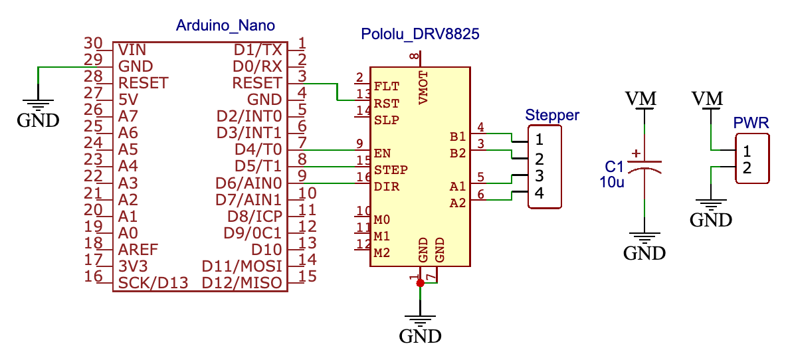

# Faraday Rotation | Arduino CLI Parser

**[Back to CODE](https://github.com/PanosEconomou/advanced-lab/tree/main/2.Faraday-Rotation/2.Code)**  
**[Return to Main](https://github.com/PanosEconomou/advanced-lab)**

## Overview

This is the script that is needed to be uploaded to the arduino in order to control the motor, and undersntand the commands given to it from the computer.

## Deciphering Commands

We created a communication protocol for the communication between the computer and the arduino in realtime. This is described here. Each message is an 9 byte string that has the following form:

`AAXXXX\n`

Here is how to decipher the message

| AA  | Decipher                                        |
|:---:|-------------------------------------------------|
|10   | Set current angle to XXXX                       |
|11   | Set current speed to XXXX                       |
|20   | Move to angle XXXX                              |
|21   | Move by angle XXXX Clockwise                    |
|22   | Move angle by XXXX Counter Clockwise            |
|30   | Send the Current angle through the serial port  |  
|-1   | Internal Commands (like help, etc.)             |

## Circuit

Here is the circuit diagram and actual circuit that we used for the arduno.

