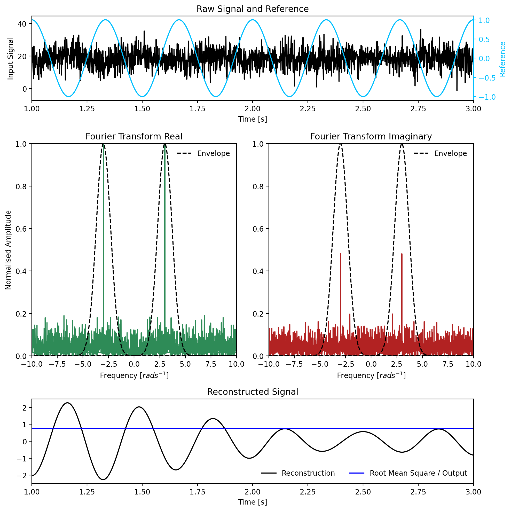
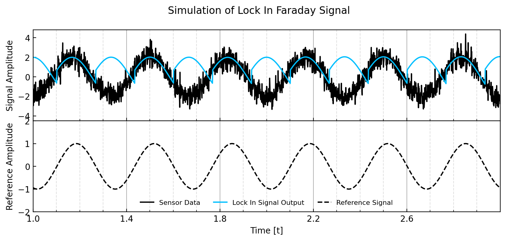
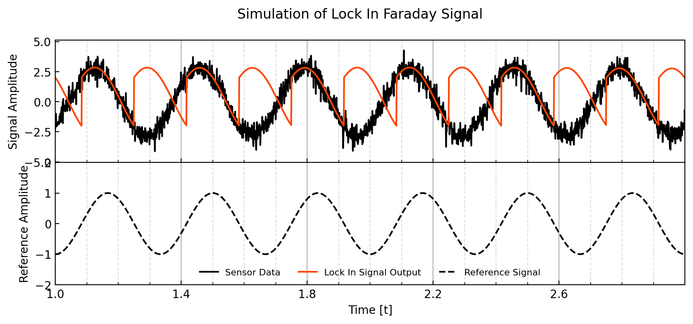
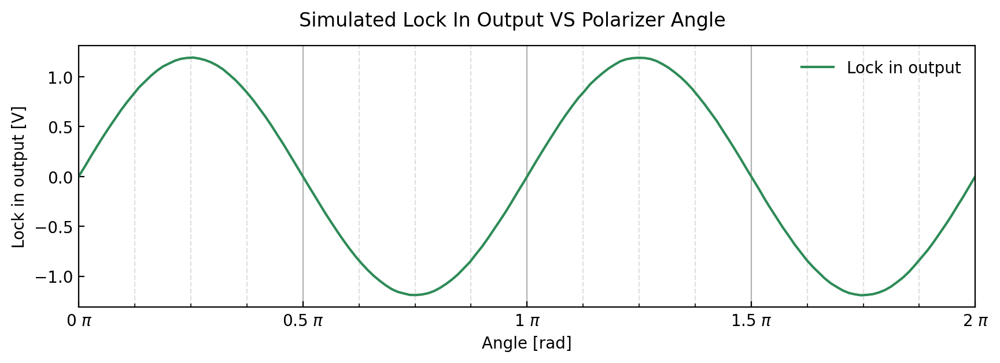
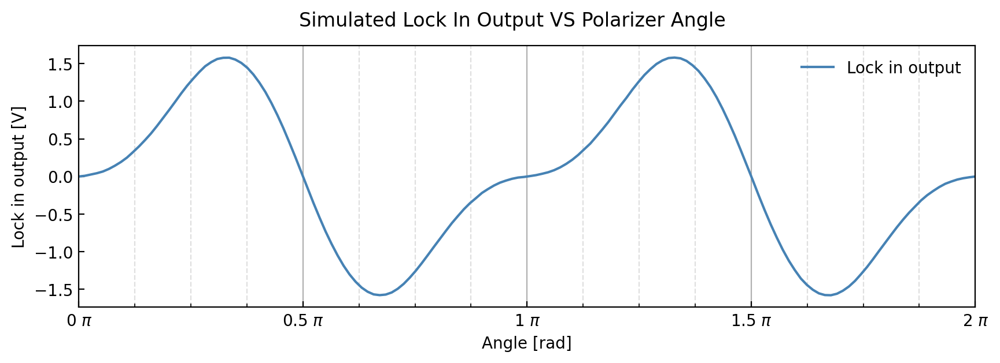

# Faraday Rotation | Waveform-Simulation

**[Back to CODE](https://github.com/PanosEconomou/advanced-lab/tree/main/2.Faraday-Rotation/2.Code)**  
**[Return to Main](https://github.com/PanosEconomou/advanced-lab)**

## Overview

This is a python module that simulates the signals generated by the experimental apparatus. It contains two main files.

1. **[wfsim.py](https://github.com/PanosEconomou/advanced-lab/blob/main/2.Faraday-Rotation/2.Code/Waveform-Sim/wfsim.py)**: The python module that is in charge in simulating everything. Essentially each component is simulated indicidually and then their signals are broadcasted together to provide a new function.
2. **[Simulation.ipynb](https://github.com/PanosEconomou/advanced-lab/blob/main/2.Faraday-Rotation/2.Code/Waveform-Sim/Simulation.ipynb)**: Jupyter notebook that uses the simulation module to generate the appropriate signals and simulation results. This can be seen as an example application of wfsim.

## Results

Here are some figures we managed to produce using **wfsim**

### lock in operation

A visual description of how the lock in amplifier works

### Lock in signal

Simulations of a lock in signal given a set of initial conditions as well as simulating noise.

### Lock in vs angle

We can also simulate the signal as a function of the polarizer angle, with and wthout an intermediate low pass filter.

Without low pass filter

With low pass filter

