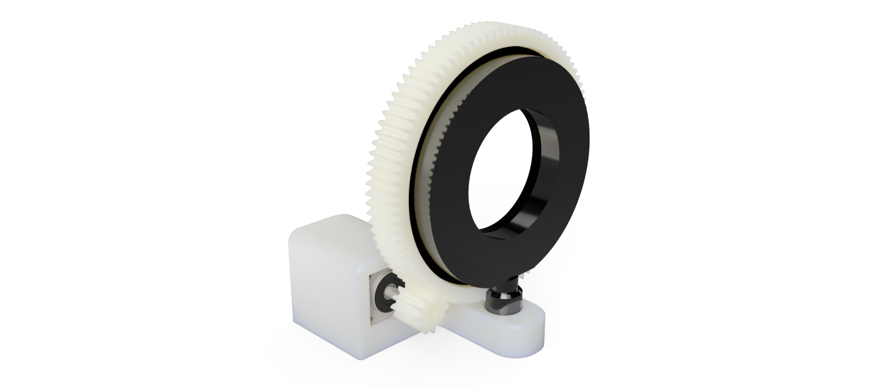
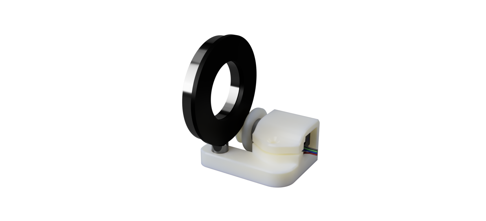

# Faraday Rotation | 3D MODELS

**[Back to Faraday Rotation](https://github.com/PanosEconomou/advanced-lab/tree/main/2.Faraday-Rotation)**  
**[Return to Main](https://github.com/PanosEconomou/advanced-lab)**

## Overview

Here we have the 3D models as well as renders for the faraday rotation experiment that we used to 3D print the gear and setup box for controlling the polarizer.

Here is the final render of the complete assembly

Here is the final, 3D printed hardware

