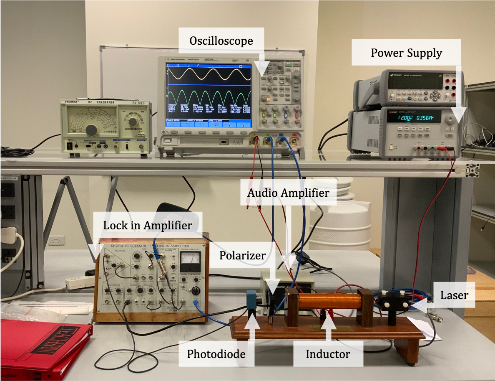
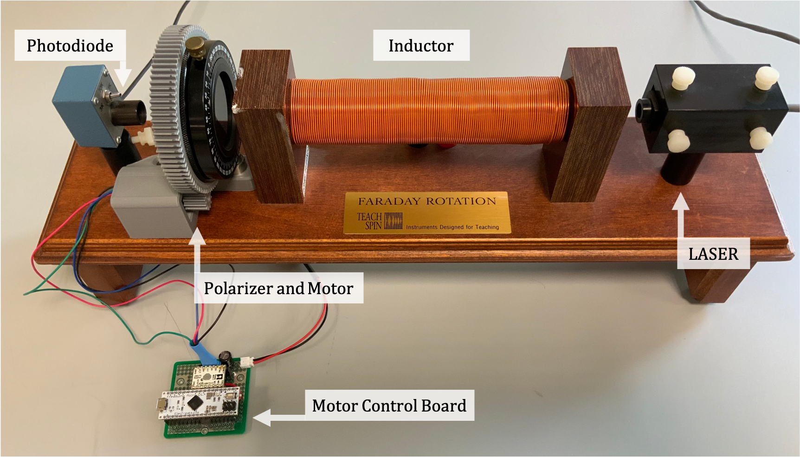

# Faraday Rotation

**[Return to Main](https://github.com/PanosEconomou/advanced-lab)**

## Overview

All resources that are related to the Faraday Rotation experiment can be found here. This includes:

- Raw Waveforms Directly from the oscilloscope
- Analysis scripts
- Pictures of the Setup
- Code Related to the control of the apparatus
- 3D models for the printed parts of the setup, along with renders

## Contents

1. **[Lab-Data](https://github.com/PanosEconomou/advanced-lab/tree/main/2.Faraday-Rotation/1.Lab-Data)**  
  Contains all the Raw data collected with the apparatus as well as analysis scripts
2. **[Code](https://github.com/PanosEconomou/advanced-lab/tree/main/2.Faraday-Rotation/2.Code)**  
  Contains all the Code that we wrote. Includes: API to interface with polarizer motor, interface with Oscilloscope, Custom Libraries, CLI and control scripts
3. **[3D Models](https://github.com/PanosEconomou/advanced-lab/tree/main/2.Faraday-Rotation/3.3D-Models)**  
  Contains the 3D Models we designed to upgrade the experiment to being autonomous, as well as their renders.
4. **[Report]()**

## Description

Faraday rotation is the rotation of the the plane of polarization of light as it passes through a material under a constant magnetic field. To experimentally measure this we used the apparatus shown in the figure below.

We augmented the setup by changing the polarizer to rotate using a motor, as well as created an application and a programmable framework to automatically and repeatedly collect measurements. The hardware modificaiton is shown in the figure below.

## Notes

In data analysis each directory contains a list of csv files that correspond to the raw data and are named accordignly to specify the differences between them. Also we have included an iPython analysis notebook in each to process and understand the data.
