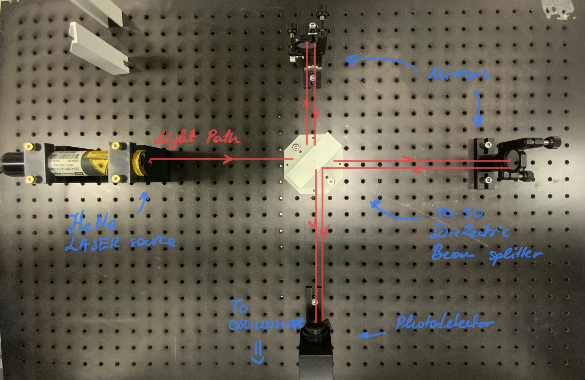

# Model Interferometry | Lab-Session #1

**[Return to Lab Data](https://github.com/PanosEconomou/advanced-lab/tree/main/3.Interferometry/1.Lab-Data)**
**[Return to Main](https://github.com/PanosEconomou/advanced-lab)**

This is a digital lab notebook entry for the Model Interferometry Lab

## Objectives

The Main objectives of this lab session are as follows.

1. Familiarize ourselves with the apparatus
2. Build a simple Michelson intereferometer and align
3. Build a Michelson interferometer with a non standard output and align
4. Use the oscilloscope to visualise the interference pattern

---

## Methodology

Here is an outline of what we did today. We also put a picture for your enjoyment.

To build the Michelson interferometer we used: 

1. 50-50 dielectric beam splitter
2. 2 Mirrors in mounts with 2 degrees of freedom
3. HeNe Laser source
4. Photodetector
5. Oscilloscope

We mounted the apparatus on the optical table as seen below.

## Results

You can find our results here

--

## Preliminary Discussion

Here is some discussion on the most important topic of this course.
