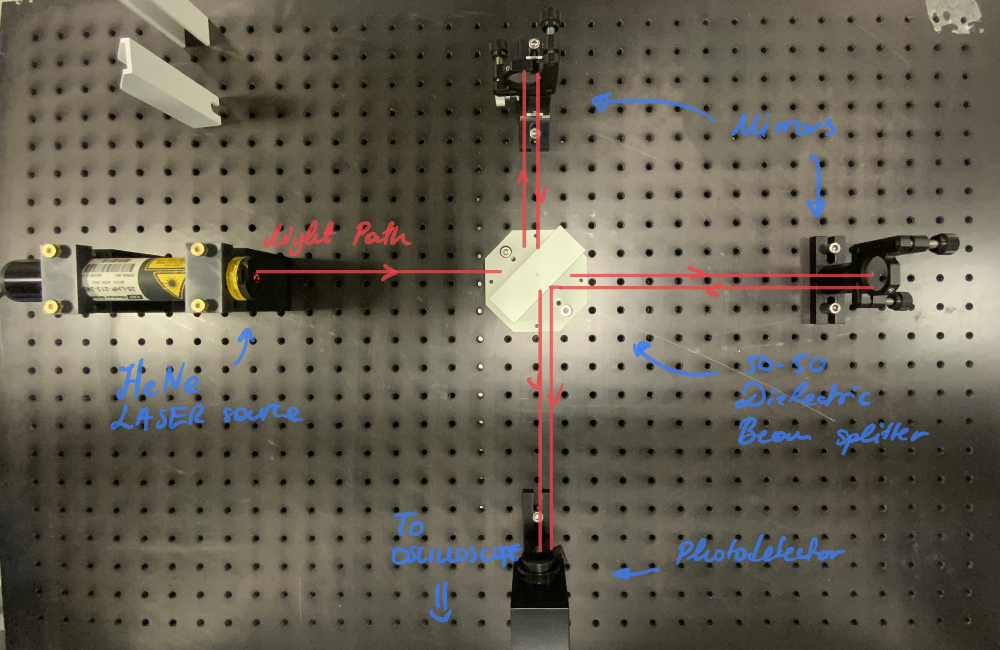
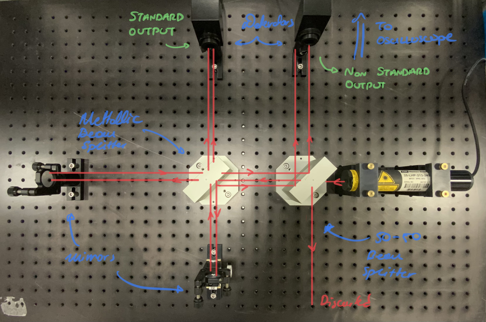

# Model Interferometry | Lab-Session #1

**[Return to Lab Data](https://github.com/PanosEconomou/advanced-lab/tree/main/3.Interferometry/1.Lab-Data)**\
**[Return to Main](https://github.com/PanosEconomou/advanced-lab)**

This is a digital lab notebook entry for the Model Interferometry Lab

## Objectives

The Main objectives of this lab session are as follows.

1. Familiarize ourselves with the apparatus
2. Build a simple Michelson intereferometer and align
3. Build a Michelson interferometer with a non standard output and align
4. Use the oscilloscope to visualise the interference pattern

---

## Methodology

Here is an outline of what we did today. We also put a picture for your enjoyment.

### Michelson Interferometer

To build the Michelson interferometer we used: 

1. 50-50 dielectric beam splitter
2. 2 Mirrors in mounts with 2 degrees of freedom
3. HeNe Laser source
4. Photodetector
5. Oscilloscope

We mounted the apparatus on the optical table as seen below.

The light path is denoted by the red lines. Interference occurs on the sensor and we are able to read the sensor data on the oscilloscope

### Michelson Interferometer with Non Standard Output

We modified the setup shown before by adding a second beam splitter. This time the beam splitter was a 50-50 metallic coated splitter, allowing us to split the beam in all four directions.

The setup looks as follows.

As seen here the non standard output was created by taking advantage of the inteference of on a dielectric beam splitted with the signals from the metallic beam splitter. 

## Alignment

To align the interferometer we used the same procedure for both types. This is outlined below.

1. Use a white card with a pinhole to visualise the laser dot.
2. Place the firmly on the table
3. Place the pinhole such that the incoming beam comes through.
4. To align for any mirror, go after the dielectric beam splitter and do the following:
    1. look at the back of the card to locate the reeflection of the light beam
    2. Adjust the thubscrews to ensure that the light passes back through the pinhole
    3. Repeat this for a couple distances along the arm of the inteferometer.
5. After aligning each mirror place the card in front of the detector.
6. After seeing the two dots, adjust the thumbscrews on the mirrors in order for both of them to overlap
7. Finally, keep finely adjusting until no fringes appear. 
8. To ensure proper alignment, the oscillocospe output should be roughly constant over time.

*Additional notes for the interferometer with the non-standard output*.

To set it up to the oscilloscope plug in the standard output to port 1, and the non-standard to port 2. Then we set the display to X-Y mode. If aligned properly, when the interferometer is disturbed slightly, we should se a circle, as the two signals are out of phase.
