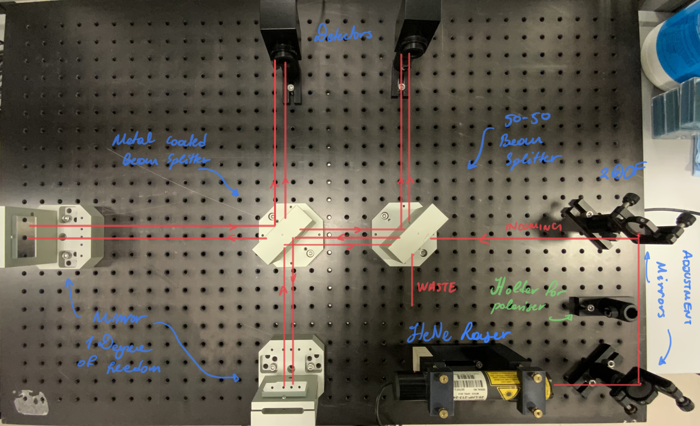
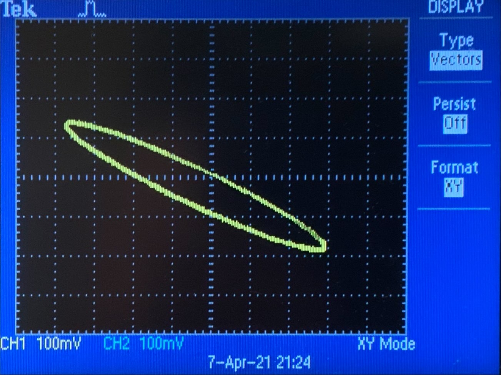

# Model Interferometry | Lab-Session #2

**[Return to Lab Data](https://github.com/PanosEconomou/advanced-lab/tree/main/3.Interferometry/1.Lab-Data)**\
**[Return to Main](https://github.com/PanosEconomou/advanced-lab)**

This is a digital lab notebook entry for the Model Interferometry Lab

## Objectives

The Main objectives of this lab session are as follows.

1. Quantify the phase difference between the non standard and the standard input of a Michelson interferometer.
2. Use 2 mirrors to provide finer beam adjustment in 3D.
3. Examine how to measure the wavelength of the light.

---

## Methodology

### Controlling the beam in 3D

To gain more control to the beam, we decided to use two mirrors before the laser to gain finer adjustment in 3D. Specifically we added 2 mirrors with 2 degrees of freedom at a 90 degree angle with respect to each other and the light as shown in the figure below.

As is evident from the picture we have included a mount for a polarizer to adjust the polarization of the incoming light for future experiments.

Note that the mirrors in the arms of the interferometer have 1 degree of freedom each. One of them has the vertiacal and the other the horisontal. While the two mirrors that direct the laser have 2 degrees of freedom each.

Furthermore we placed the metal coated beam splitter at the center of the interferometer to obtain the standard signal, and a 50-50 dielectric splitter to obtain the non standard signal.

The aim of todays experiment was to detect the **phase shift** between these to signals, and adjust such that they were not 180 degrees apart. 

### Alignment

To align the setup we used the same methodology that is described in the entry for [Lab 1](https://github.com/PanosEconomou/advanced-lab/tree/main/3.Interferometry/1.Lab-Data/1.INTERFEROMETRY__Apr-02-2021__11-27-16).

### Signal

We hooked up the sensor output to the oscilloscope and turned on the XY mode. The expected signal at proper alignment would be elliptical because of the phase difference between the standard and nonstandard outputs.

---

## Results

After considerable fiddling and tweaking we were able to obtain the following output for the signal on the oscilloscope.

This is as good as we were able to get. However, by revising our setup in the next lab session we will be able to obtain a better signal and use it to measure the wavelength of the laser.

---

## Preliminary Discussion

Pehaps the only thing to discuss here would be what causes the phase shift between the two signals. The phase shift seems to be caused by the fact that the central splitter for the standard output is not a 50-50 splitter. As a result, interference would happen at different amplitudes, causing the signal to appear *delayed* in the final picture. 

The image of the oscilloscope illustrates that delay very well. if both of the signals were in phase, we would be seing a single line upon deflection at y=x. However, now that both of the signals are having the same values, it looks as if the y-axis is chasing the x-axis resulting in the circular pattern shown above.
