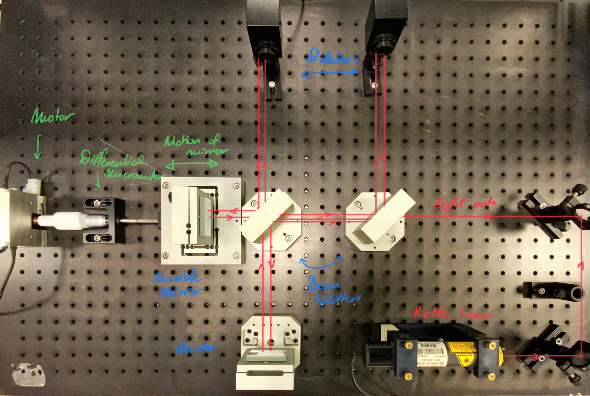
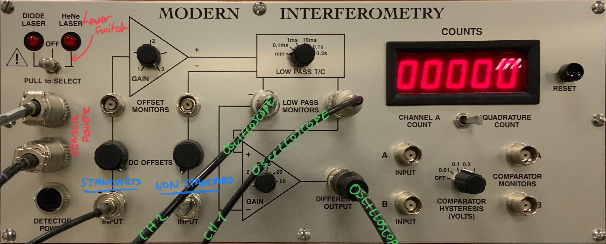
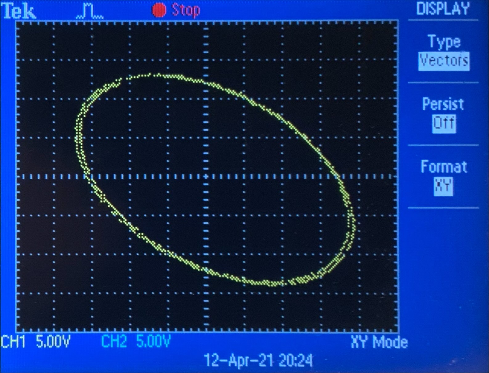
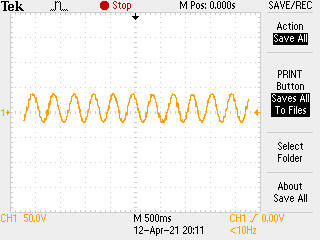

# Model Interferometry | Lab-Session #3

**[Return to Lab Data](https://github.com/PanosEconomou/advanced-lab/tree/main/3.Interferometry/1.Lab-Data)**\
**[Return to Main](https://github.com/PanosEconomou/advanced-lab)**

This is a digital lab notebook entry for the Model Interferometry Lab

## Objectives

The Main objectives of this lab session are as follows.

1. Configure the Nonstandard michelson Interferometer
2. Measure the wavelength of the HeNe laser.

---

## Methodology

We used the Michaelson Inteferometer described in [Lab-Session #2](https://github.com/PanosEconomou/advanced-lab/tree/main/3.Interferometry/1.Lab-Data/2.INTERFEROMETRY__Apr-07-2021__14-57-05), however we made a twist. The twist was to place one of the mirrors on a movable base. We moved this base with a differential micrometer attached to a slow moving motor.

Specifically the setup can be seen in the figure below.

As you can see the only difference in this setup is the left mirror is attached to a base that can move according to the reading of the micrometer.

The **mictrometer** moves by **5 μm per revolution**, while the **motor** moves at **1 rpm**.

To better process the signal from the two detectors we used the model interferometry signal processor by the Magical Teachspin company. Essentially the signal processor would take the standard and no standard output and will bias them by an adjustable amount, and then aplify one signal with respect to the other to pronounce their difference. The circuit is shown in the image below.

### Calibration

To calibrate our equipment we used the oscilloscope. Specifically we plotted the standard signal against the non-standard signal as shown in [Lab-Session #2](https://github.com/PanosEconomou/advanced-lab/tree/main/3.Interferometry/1.Lab-Data/2.INTERFEROMETRY__Apr-07-2021__14-57-05) and adjusted the mirrors in the setup until we saw a circular shape. This would indicate that there is a less than 180 degree phase difference between the two signals, that we could hence use to measure really small differences in the interference pattern. The circular pattern we got after calibrating is shown in the figure below.

### Measuring the Wavelength

Specifically, when a change in one of the distances in the arms of the interferometer occurs the two signals will mirror each other. But since they are out of phase, we will notice a spike in their difference while the transition is happening. We can use this to measure the wavelength.

To measure the wavelength of the HeNe Laser, we therefore move the mirror and then look at the oscillating pattern of the fringes. Their distance will give us the wavelength.

---

## Results

The Pattern we got, straight out of the oscilloscope is shown in the figure below.

We now need to convert the time axis to the distance using the appropriate scaling constants of the motor and micrometer.
